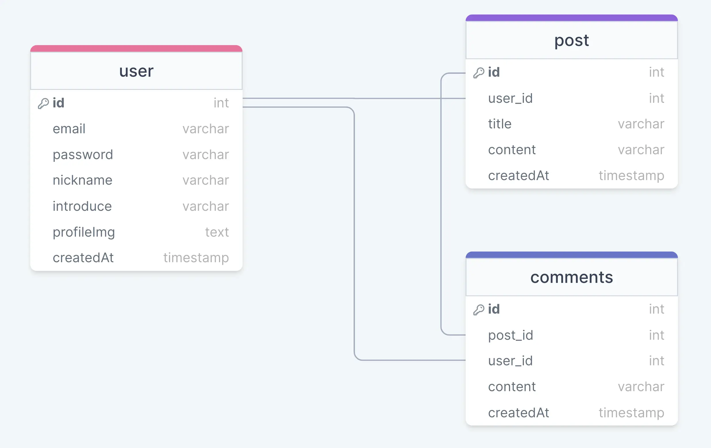
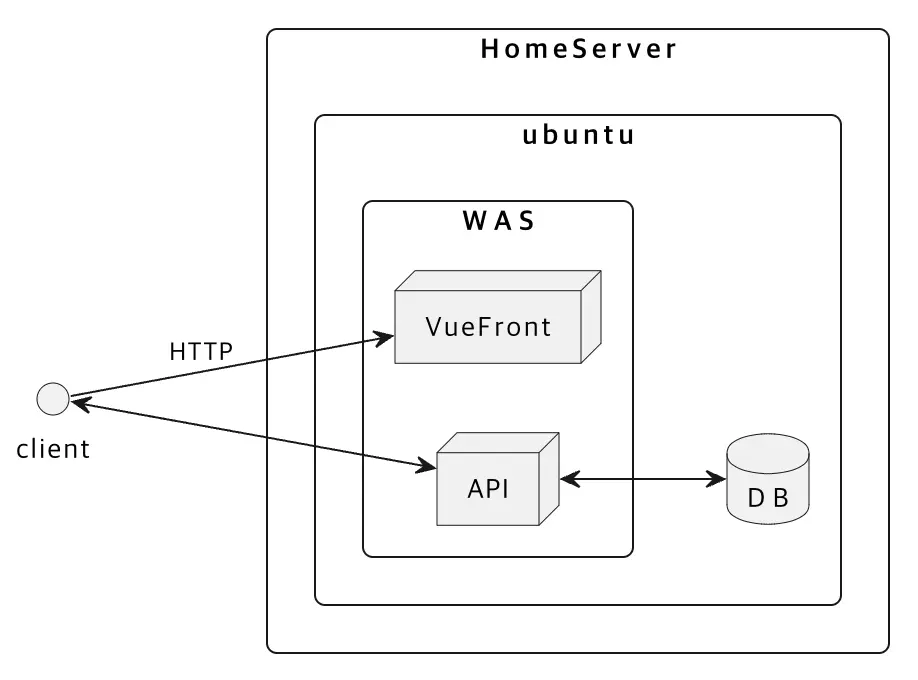
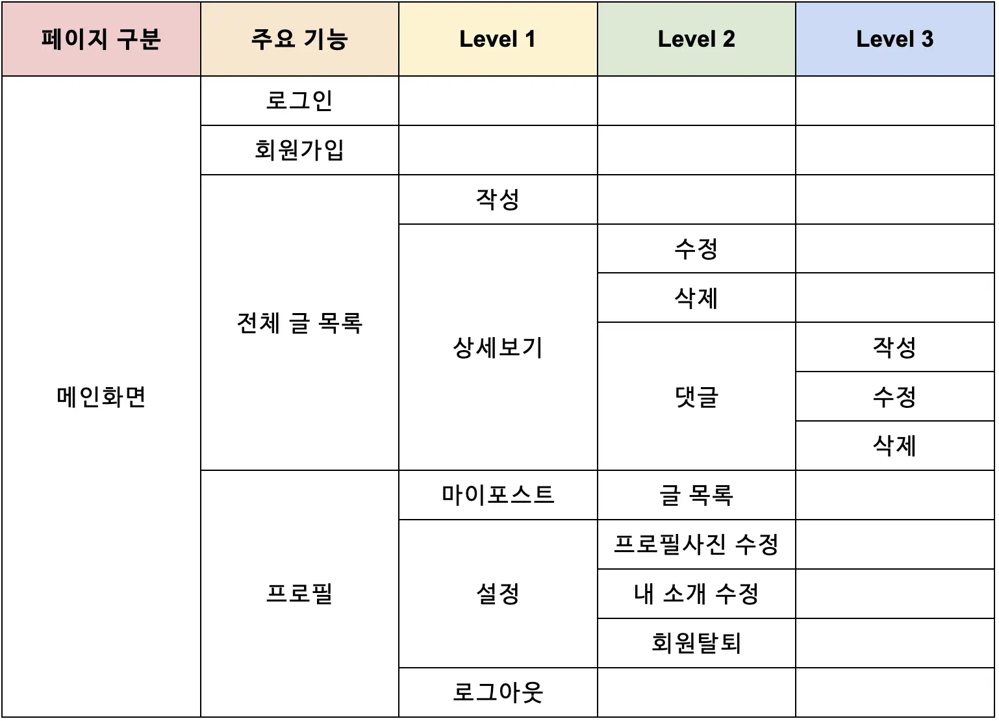

#### 2023년 2학기 개인 프로젝트

### 🎯&nbsp;Subject

> 블로그사이트 VLO

### 🗓️&nbsp;Date

> 2023.07 ~ 2023.12

### 🚀&nbsp;Intro & Function

> 첫 개인 프로젝트로 간단하게 게시판 형태를 구현하고자 하였습니다. 단순한 게시판 보다는 기능이 더 있는 프로젝트를 만들고자 하였고, velog 라는 블로그 플랫폼에서 아이디어를 얻어 만들게 되었습니다.

### 📚&nbsp;Tech Stack

### 📂&nbsp;ERD

    

### ⚙️&nbsp;Architecture

---

    
    

### 🔗&nbsp;Github link

> [Github](https://github.com/devQra/vlo)

### 📖&nbsp;blog link

> [velog](https://velog.io/@cl0ud/토이프로젝트-블로그플랫폼-개요)
